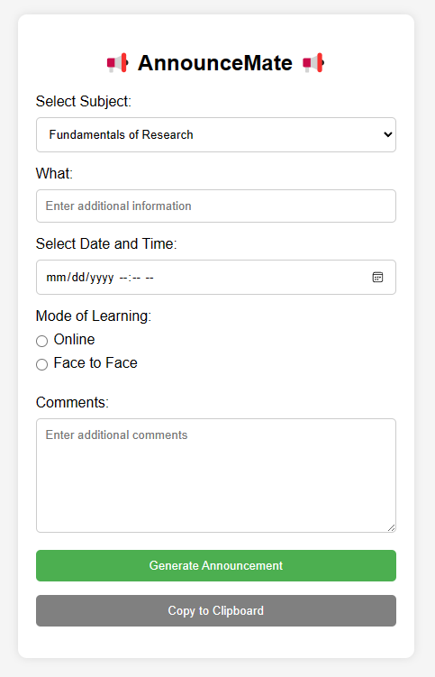

<!-- 

    <h1 align="center">AnnounceMate</h1>
    
Your Instant Ally in Crafting Perfect Announcements!
    

 -->

# 📢 AnnounceMate 📢
Your Instant Ally in Crafting Perfect Announcements!

## Table Of Contents

* [About the Website](#about-the-website)
  * [Screenshots](#screenshots)
  * [Built With](#built-with)
* [Roadmap](#roadmap)
* [Contribution](#contribution)
* [License](#license)
* [Authors](#authors)

# About the Website
AnnounceMate is a website generator tool for important class announcement. It is easy to use and it is free.

## Background
This website was created as a side joke during our meeting for having announcement templates. A random what if just pop up in my head and I started to list down the things needed for this website. After that, I started to propmt the idea to ChatGPT and carefully arranged the codes.

## Screenshot
This is the current UI of the website. It is still in development and will be updated soon.

    

## Built With
The following tools and techonologies were involved in the making of this project

* HTML(Hyper Text Markup Language)
* CSS(Cascading Style Sheets)
* JS(Javascript)

(<a href="#top">back to top</a>)

# Roadmap
-   [x] ~~Initial Setup~~
-   [ ] Add more features
-   [ ] Improve the UI
-   [ ] Improve the Contraints
-   [ ] Connect to a Database
<!-- 
(<a href="#top">back to top</a>)
 -->

 

# Contribute
Contributions are what make the open source community such an amazing place to be learn, inspire, and create. Any contributions you make are **greatly appreciated**.
* If you have suggestions for adding or removing projects, feel free to [open an issue](https://github.com/Rednaxela5/nexatech-job-application-portal/issues/new) to discuss it, or directly create a pull request after you edit the *README.md* file with necessary changes.
* Please make sure you check your spelling and grammar.
* Create individual PR for each suggestion.
* Please also read through the [Code Of Conduct](https://github.com/Rednaxela5/nexatech-job-application-portal/blob/main/CODE_OF_CONDUCT.md) before posting your first idea as well.

## Creating A Pull Request

1. Fork the Project
2. Create your Feature Branch (`git checkout -b feature/AmazingFeature`)
3. Clone and checkout that branch locally.
4. Commit your Changes (`git commit -m 'Add some AmazingFeature'`)
5. Push to the Branch (`git push origin feature/AmazingFeature`)
6. Open a Pull Request

 

# License

Distributed under the MIT License. See [LICENSE](https://github.com/Rednaxela5/nexatech-job-application-portal/blob/main/LICENSE) for more information.

# Author

* **Alexander Porlares** - [@Rednaxela5](https://github.com/Rednaxela5)

(<a href="#top">back to top</a>)

